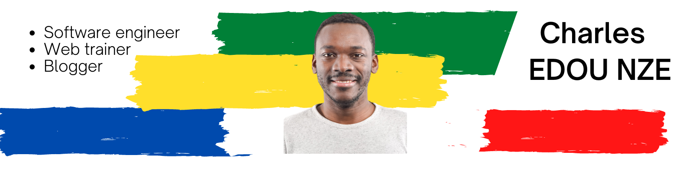

## About me 👋

I'm Charles, software engineer, Web trainer and Blogger (personal finance, coaching, ...)

<!--
**charlesen/charlesen** is a ✨ _special_ ✨ repository because its `README.md` (this file) appears on your GitHub profile.
-->

- 🔭 I’m currently working on web technologies like HTML, CSS, JS, PHP, Symfony and Ionic (for mobile Apps)
- 🌱 I’m currently learning ...
- 💬 I blog on personal finance, investing and everything productivity and personal goals (www.pepite.club)
- 📫 How to reach me: 
   - twitter (charlesen7) : www.twitter.com/charlesen7
   - website : www.charlesen.fr

## Tech

Languages and Tools🛠:

   
<code></code>
<code></code>
<code></code>
<code></code>
<code></code> 
<code></code>
<code></code>
<code></code>
<code></code>
<code></code>
<code></code>
<code></code>
<code></code>
<code></code>
<code></code>
<code></code>

### My Projects ✨:

Hope to hear from you soon

Charles
